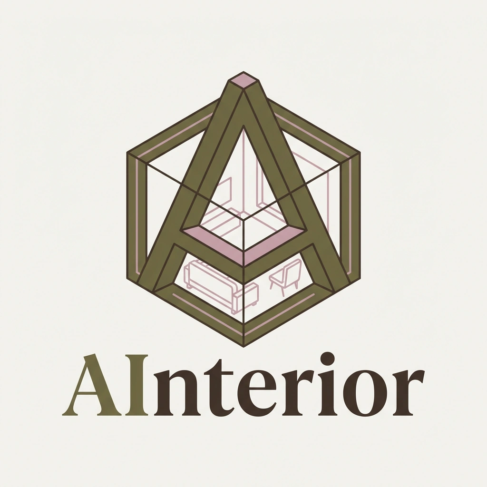

<div align="center">
  
  <h1>AInterior</h1>
  <p>Веб-приложение для проектирования и визуализации интерьерных решений с AI-ассистентом</p>
</div>

## Быстрый старт

```bash
# Запустить все сервисы
docker compose up -d
```

Фронтенд доступен на http://localhost:3000


**Требования:** Docker, Docker Compose

## Архитектура

```
Frontend (React + Three.js)
    ↓
Backend Service (API Gateway)
    ↓
├── Auth Service (JWT, Email)
├── Agents Service (AI генерация сцен)
├── Chat Service (AI-диалоги)
├── Project Service (CRUD проектов)
└── Storage Service (S3/MinIO)
    ↓
PostgreSQL, MinIO, Redis, RabbitMQ
```

### Сервисы

| Сервис | Порт | Назначение |
|--------|------|------------|
| `frontend` | 3000 | React SPA с 3D-редактором |
| `backend-service` | 8000 | API Gateway |
| `auth-service` | 8001 | Авторизация, JWT |
| `chat-service` | 8003 | AI-чат |
| `project-service` | 8004 | Управление проектами |
| `storage-service` | 8005 | Файловое хранилище |
| `agents-service` | 8006 | AI генерация интерьеров (ObLLoMov) |

## Структура

```
AInterior/
├── auth-service/          # Авторизация
├── backend-service/       # API Gateway
├── agents-service/        # AI генерация
├── chat-service/          # Чат с AI
├── project-service/       # CRUD проектов
├── storage-service/       # S3 хранилище
├── frontend/              # React UI
├── database/              # SQL схемы и миграции
├── scripts/               # Утилиты
└── docker-compose.yml     # Оркестрация
```

## Технологии

**Backend:** FastAPI, SQLAlchemy, PyTorch, ObLLoMov, AI2-THOR, JWT

**Frontend:** React, Three.js, React Three Fiber, Vite

**Инфраструктура:** Docker, PostgreSQL, MinIO (S3), Redis, RabbitMQ

## API

Swagger UI доступен после запуска:
- Backend Service: http://localhost:8000/docs
- Auth Service: http://localhost:8001/docs
- Chat Service: http://localhost:8003/docs
- Project Service: http://localhost:8004/docs
- Storage Service: http://localhost:8005/docs
- Agents Service: http://localhost:8006/docs

